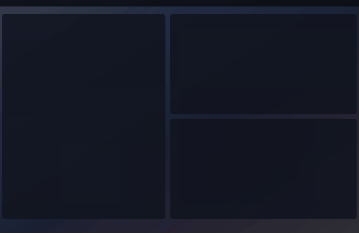

# mach-boot

Boot screens for **MACH**, my macOS desktop setup. macOS won't let you replace
the real boot screen (Secure Boot), so this plays a full-screen animation in a
transparent overlay right after login, once per boot.

`mach-boot` is the player. Each boot screen lives in its own folder under
`screens/`, and you pick which one plays at boot.



*`strike`: a targeting-pod HUD locks onto a camo voxel MACH, and an F-15E
drops a TNT block on it.*

## Quick start

```sh
./mach install        # build the player and play the active screen at each boot
./mach play           # play it right now
./mach list           # see the screens you have
```

## Commands

| Command | What it does |
|---|---|
| `./mach play [screen]` | Play a screen now (default: the active one) |
| `./mach list` | List screens; `*` marks the active one |
| `./mach use <screen>` | Set the screen that plays at boot |
| `./mach new <screen>` | Create `screens/<screen>` from the starter template |
| `./mach preview [screen]` | Open a looping preview in Helium |
| `./mach gif [screen]` | Record `docs/<screen>.gif` |
| `./mach build [screen]` | Build the player; with a screen, also run its `build.py` |
| `./mach install` / `uninstall` | Turn playing at login on or off |

## Making a new screen

```sh
./mach new neon       # copies templates/basic to screens/neon
./mach preview neon   # edit screens/neon/index.html and watch it
./mach use neon       # boot with it
./mach gif neon       # record a GIF for this README
```

A screen is a folder with:

| File | Required | Purpose |
|---|---|---|
| `index.html` | yes | The animation, drawn over the desktop, so keep the background transparent |
| `screen.json` | no | `name`, `description` and `duration` in seconds (used by `list` and `gif`) |
| `sound.wav` | no | Played by the player when the screen starts |
| `build.py` | no | Generates assets, for example the soundtrack; run with `./mach build <screen>` |

`index.html` talks to the player through three hooks:

- **`MACH.start()`**: the player calls this to start the animation, and starts `sound.wav` at the same moment.
- **`__seek(t)`**: draw the frame at `t` seconds. `./mach gif` uses this to record one frame at a time, so make each frame depend only on `t`.
- **`webkit.messageHandlers.mach.postMessage('done')`**: send this when the animation ends so the player can quit. It quits anyway after `duration` + 3 seconds.

The player adds the class `preview` to `<body>` when there is no desktop
behind the page (previews and GIFs), and `recording` while `./mach gif`
runs, so a screen can hide hints that shouldn't show up in the GIF.

## How it works

- **`app/main.swift`**: the player, built to `bin/mach-player`. It opens a borderless, click-through window above everything, loads the screen in a WebKit view, and plays its sound.
- **`login.sh`**: runs at every login through the `dev.mach.intro` LaunchAgent. It only plays on the first login after a power-on or restart: it compares `kern.boottime` with `~/Library/Caches/mach-boot/last-boot`, then waits for the Dock and Finder so the overlay lands on a ready desktop.
- The active screen's name is stored in `.active`. This file isn't committed, and without it the player uses `strike`.

## Troubleshooting

If a screen doesn't play after a restart:

```sh
launchctl print gui/$UID/dev.mach.intro   # is the agent loaded?
cat /tmp/mach-intro.log                   # any errors?
rm ~/Library/Caches/mach-boot/last-boot   # forget this boot, then log out and back in
```

## Credits

The Strike soundtrack uses CC0 recordings from Freesound; see
[`screens/strike/sources/CREDITS.txt`](screens/strike/sources/CREDITS.txt).
The TNT fuse and explosion are Minecraft sounds (© Mojang). `build.py` reads
them from a local Minecraft install and mixes them into `sound.wav`. The
original sound files aren't in this repo, but the mixed `sound.wav` is.
